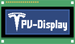

<h2 align="center">"PV-Display" Project - Monitor power flows of your Tesla Powerwall</h2>

      
    
    
    
    
    

## 💡 Short description
This project uses an ESP8266 with attached LCD-Display to connect to the local API of the Tesla Powerwall (V2). It is displaying all the current power flows (grid, home, solar, battery) and the SOC (state of charge).

## 🎈 Showcase
**
A picture says more than a thousand words!
**

(This is the main screen.)

## ⚙ Features
- [Main screen](#-showcase) includes:
    - SOC (state of charge)
    - Four different power flows (grid, home, solar, battery)
- Power flows are formatted in an organized manner. No overlapping will happen, units of values are converted to properly fit and look nice. :-)
- Indicator (dot in upper right corner) for the current API request status

For more information on all the different screens have a look at [this wiki-page](https://github.com/MoritzLerch/pv_display/wiki/Different-screens).

## 👾 Installation and Usage

- You can find a **quick start guide and documentation** [here](https://github.com/MoritzLerch/pv_display/wiki). Have fun in the Wiki!
- If you want to know, how the display shows the current data from the Powerwall check out this [Wiki-Page](https://github.com/MoritzLerch/pv_display/wiki/Different-screens). Enjoy exploring!

## 🤝 License and credits

### License

Project code is licensed under MIT-License, see `LICENSE` for more information.

### Logo and Icon License
The PV-Display logos, graphics and pictures (everything in `/assets`) are copyright (c) Moritz Lerch, all rights reserved, and may not be used without a permission. If you would like to use the logos, graphics or pictures please contact the author in order to get a permission.

### Credits
The API requests are heavily based on the [powerwall2](https://github.com/vloschiavo/powerwall2) API documentation (Apache-2.0 License).

---
**Disclaimer**: *In accordance with the MIT-License, I assume no liability for any damage to you or any other person or equipment. There is no warranty on this open source project.*
